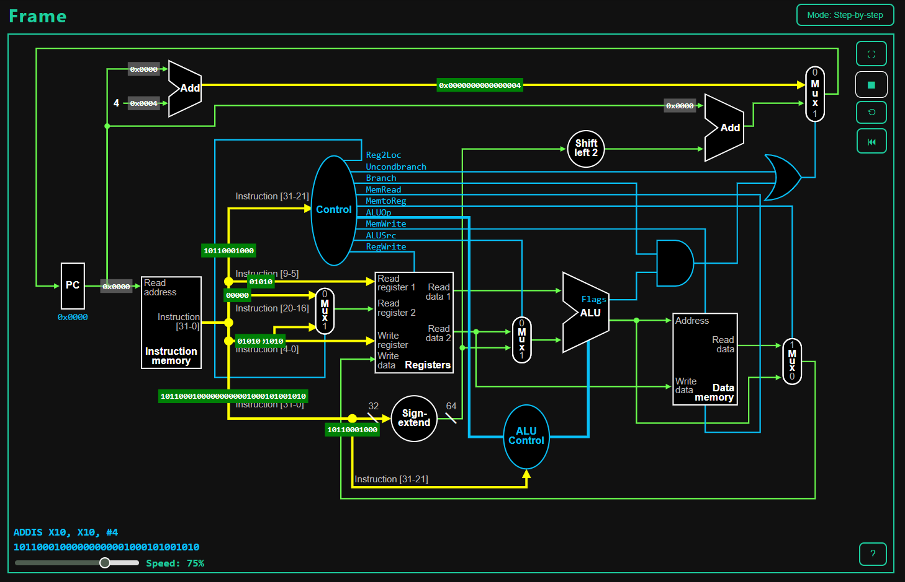

# LEGv8 Single-Cycle Simulator
Nhớ thêm X30
A web-based, visual LEGv8 instruction set simulator designed for educational purposes. This tool helps students and enthusiasts understand the flow of data and control signals within a single-cycle LEGv8 processor datapath for each instruction.

  
   
  <em>Legv8-Simulator Screenshot</em>

## ✨ Features

*   **Visual Datapath:** An interactive SVG-based diagram that visualizes the LEGv8 single-cycle datapath.
*   **Real-time Animation:** See data and control signals move through the datapath as each instruction is executed.
*   **Step-by-Step Execution:** Execute your code one instruction at a time to carefully observe the state of each component.
*   **Code Editor:** A simple built-in editor with line numbers to write or import LEGv8 assembly code.
*   **Parser & Validator:** Compiles assembly code, resolves labels, and validates syntax before execution, providing clear error messages in a log panel.
*   **State Inspection:** (Optional, if you add this feature) View the current values of all 32 general-purpose registers and the contents of data memory.

## 🚀 Getting Started

1.  **Open the Simulator:** Simply open the `index.html` file in a modern web browser (Chrome, Firefox, Edge).
2.  **Write or Import Code:**
    *   Type your LEGv8 assembly code directly into the code editor.
    *   Or, click the **"📤 Import Code File"** button to load an assembly file (`.s`, `.asm`, `.txt`) from your computer.
3.  **Compile:** Click the **"⚙️ Compile"** button. This will:
    *   Parse your assembly code.
    *   Resolve any labels used in branch instructions.
    *   Validate the syntax.
    *   Report any errors or a success message in the **Log** panel.
4.  **Execute:** If compilation is successful, the **"▶ Execute"** button will be enabled.
    *   Click **"▶ Execute"** to run the entire program with full animation.
    *   (Optional, if implemented) Use the "Step" button to execute one instruction at a time.
5.  **Restart:** Click the **"↺ Replay"** button to stop the current execution, clear the animation, and reset the simulation state, allowing you to run the code again from the beginning.

## 🛠️ Supported Instruction Set

This simulator supports a subset of the LEGv8 instruction set, focusing on core integer operations.

| Instruction Type | Supported Mnemonics                                    |
| ---------------- | ------------------------------------------------------ |
| **R-Type**       | `ADD`, `SUB`, `AND`, `ORR`, `EOR`, `ADDS`, `SUBS`, `ANDS` |
| **D-Type**       | `LDUR`, `STUR`                                         |
| **I-Type**       | `ADDI`, `SUBI`, `ANDI`, `ORRI`, `EORI`, `SUBIS`          |
| **B-Type**       | `B`, `BL`                                              |
| **CB-Type**      | `CBZ`, `CBNZ`                                          |
| **B.cond-Type**  | `B.EQ`, `B.NE`, `B.GT`, `B.LT`, `B.GE`, `B.LE`, etc.    |

### Assembly Syntax Notes:

*   **Comments:** Use `//` for single-line comments.
*   **Labels:** Define a label by placing it on its own line or before an instruction, followed by a colon (e.g., `MyLabel:`).
*   **Registers:** Registers can be specified as `X0`-`X30`, `XZR`.
*   **Immediates:**
    *   Arithmetic immediates (`ADDI`, `SUBI`) should be decimal (e.g., `#10`, `#-5`).
    *   Logical immediates (`ANDI`, `ORRI`) should be hexadecimal (e.g., `#0xFF`).
    *   Memory offsets (`LDUR`, `STUR`) are decimal.

## 🔧 Development & Project Structure

This project is built with vanilla HTML, CSS, and JavaScript, with no external frameworks required.

*   `index.html`: The main entry point and UI structure.
*   `style.css`: Contains all the styling for the UI components and the SVG datapath.
*   `main.js`: The main script that ties together UI events, parsing, and execution flow.
*   `/Scripts`: Directory containing the core logic modules.

## 💡 How It Works

The simulation process follows these main steps:

1.  **Parsing (Compilation):**
    *   **Pass 1 (Label Resolution):** The `buildLabelTable` function scans the entire code to find all labels and map them to their memory addresses.
    *   **Pass 2 (Instruction Parsing):** The `parseLegv8Instruction` function processes each line, validates its syntax against the supported instruction formats, and resolves branch labels to target addresses using the label table. Any errors are collected.
2.  **Validation:** The `validateParsedResults` function checks the entire set of parsed instructions. If any errors were found, execution is blocked.
3.  **Encoding:** For simulation, each parsed instruction is converted into its 32-bit binary machine code representation by the `encodeLegv8Instruction` function.
4.  **Execution Loop:**
    *   An `async` function `execute()` loops through the instructions.
    *   For each instruction, a simulation step is triggered.
    *   **Signal Generation:** The state of each datapath component is calculated based on the current instruction and the state of connected components.
    *   **Animation:** As signals "arrive" at a component, new animations are primed. The `startSignalAnimation()` function begins all animations for the current stage simultaneously, creating the visual flow.
    *   **State Update:** At the end of the animated cycle, the architectural state (PC, registers, memory) is updated for the next instruction.
    *   The `execute` loop `await`s a promise that resolves when the current instruction's primary animation path (e.g., the PC update) completes, ensuring a sequential flow.

## 🤝 Contributors
* [@HCMUS-HQHuy](https://github.com/HCMUS-HQHuy) - Huỳnh Quốc Huy
* [@77x17](https://github.com/77x17) - Phan Ngưng
---